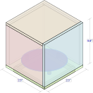

# MoodLight

In this assignment you will create an electronice object. I have provided a baseline product to start you off. It is your resposibility to edit this foundational design to your liking. The assignment will test your basic fabrication and programming abilities, as well as your ability to create a completed object.

Creating an object with only minimal changes to the foundational design is an acceptable response to this assignment.

**Due date:** 04/11

**Deliverables:** The Moodlight, A document about your light similar to this one.

### Design and Fabrication

[This design](moodlight_laserpattern.svg) can be easily cut at the E4 laser lab but you are responsible for setting up the file and cutting it correctly. The [E4 Laser Lab](https://epay.newschool.edu/C21120_ustores/web/store_main.jsp?STOREID=56) sells acrylic but for the really good stuff you need to walk down to [Canal Plastic](https://www.canalplastic.com/). Canal plastic also has cement and applicators for the acrylic but I will be leaving some in the Making Center equipment check out on the 2nd floor.

I will bring in 3M machine screws, nuts, and standoffs, copper tape, and hook-up wire.

This design uses only two touch sensors as input. The accelerometer is available as well but that would require further testing. Panel mount buttons, and other parts can be easily integrated by creating the correct sized holes in the acrylic. Buttons and panels that are soldered onto protoboard would requiere the correct sized holes in the acrylic and additional acrylic panels to supprot the protoboard. Invisible touch sensors are also possible by positioning the copper sensor behind the acrylic.





### Interface

Interface prototyping and programming should be begun and, at least partially tested, before fabrication begins.

1. Unit is turned on.

2. Touching sensor A turns the light on.

3. Touching sensor B enters editing mode.

4. In editing mode, holding sensor A changes the light colors.

5. Touching sensor B exits editing mode.

6. Touching sensor A turns the light off.

### Parts & Materials List

- *Ciruitplayground*
- USB cable
- hook-up wire
- Copper tape
- 3M machine screws / washers (2)
- 3M/6mm stand-offs (3)
- Acrylic for laser cutting
- Solder
- *Scigrip 4* acrylic cement

### Code

```python
print('Hello, World!')
```

### Photos


