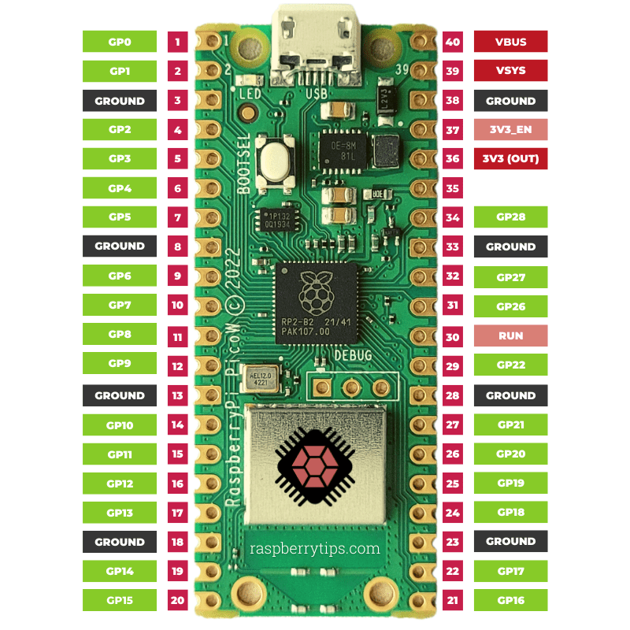
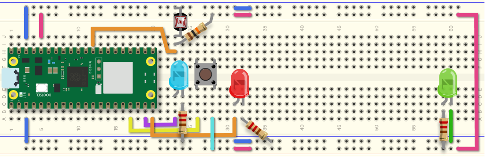

# My First Object

## Asignment objectives

- [ ] Set up your development environment. Can you program your microcontroller?
- [ ] See data in the _Serial Port Monitor_.
- [ ] Be able to multitask with _Circuit Python_. Blink an **LED** without using _time.sleep_ and toggle a button.
- [ ] Understand the code.

## Breadboard

The following steps assume you have a breadboard set up with your _Raspberry PI PICO_. PI should be powering the breadboard with PIN 36 for power and one of the ground pins (3 and or 38).






## Step one


Ω
## temp

```python
import digitalio
import analogio
import pwmio
import time
import board
import random

# LEDs
# on off led
led = digitalio.DigitalInOut(board.GP14)
led.direction = digitalio.Direction.OUTPUT
led.value = True
# PWM LED
led2 =pwmio.PWMOut(board.GP15, frequency=1000)
led2.duty_cycle = 0

# Inputs
# a button
button = digitalio.DigitalInOut(board.GP13)
button.direction = digitalio.Direction.INPUT
button.pull = digitalio.Pull.DOWN

# an analog input
sensor = analogio.AnalogIn(board.GP26)

# keep track of the states of the object
machine_state = False # Keeps track of if the machine is on or off.
button_pressed = False # To take action only once when the button is pressed

# Inside the while loop
while True:
    if button.value: # check if the button is pressed
        print('if')
        if button_pressed == False: # only take action once when the button is pressed
            machine_state = not machine_state
            button_pressed = True
    else:
        print('else')
        button_pressed = False # reset the button_pressed variable
    led.value = machine_state # update the LED
    print(button.value)
    # print(sensor.value)
    time.sleep(0.1)
```
