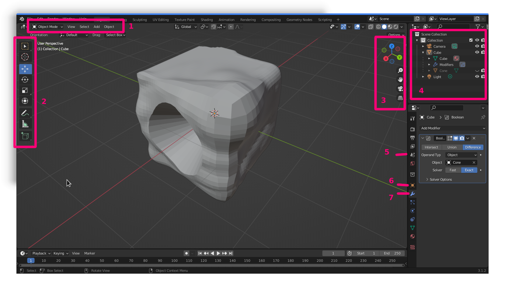

# Blender

Blender allows many options to create 3d objects. The objects can be rendered for screen or exported as STL files for 3d printing.

## Interface basics

1. Mode chooser and options.
   - *Object Mode* for creating and transforming objects.
   - *Edit Mode* for editing the points, lines, and faces that make up objects.
   - *Sculpt Mode* for using sculpting tools on object meshes.
2. Tools for this particular mode.
3. View tools
4. Outline
5. Scene options. Change the measurment units here.
6. Object settings
7. Modifiers
    Add non-destructive filters to the selected object.

    - Array
    - Bevel
    - Mirror
    - Simple Deform
    - Solidify Surface

## Some videos

- [Blender Basics](https://www.youtube.com/watch?v=nIoXOplUvAw)
- [Creating with lathe](https://www.youtube.com/watch?v=YFX7iqfqJaU)
- [Extruding](https://www.youtube.com/watch?v=oF1UbZGtjrY)
- [Extrude along path](https://www.youtube.com/watch?v=31rhH3FM9-c)
