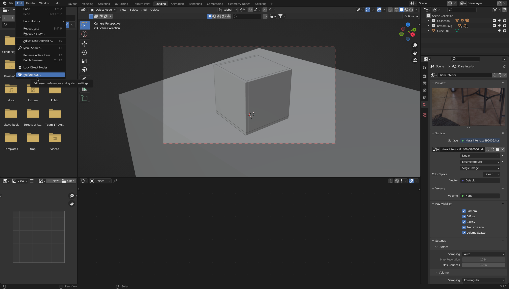
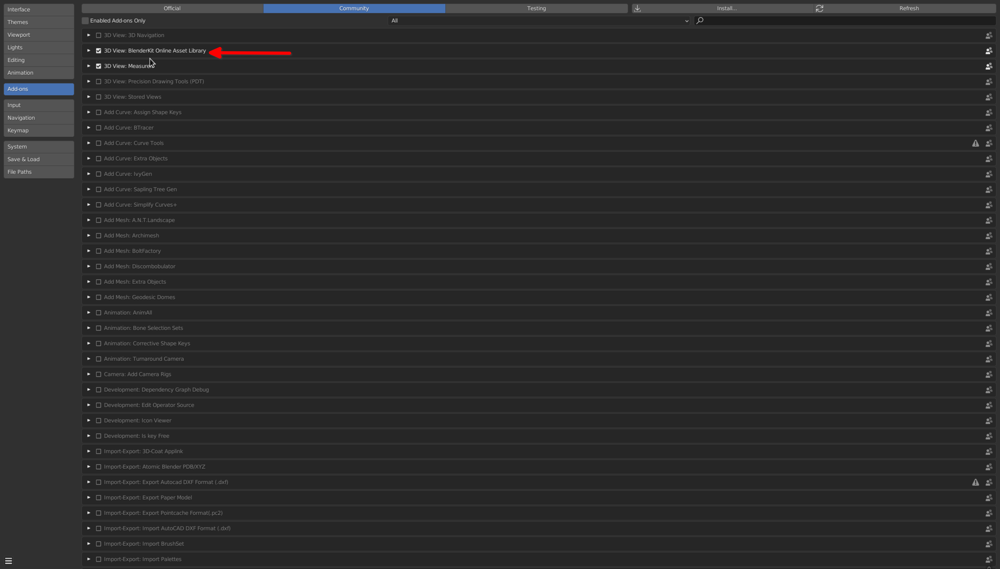
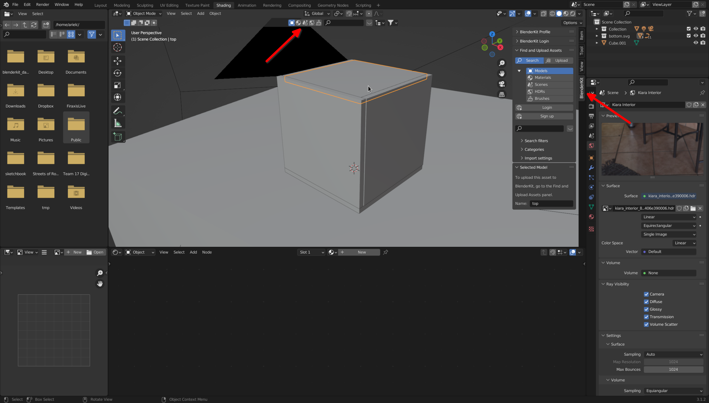
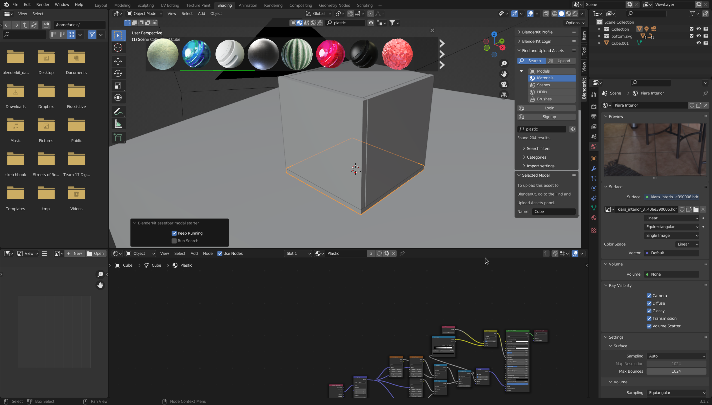
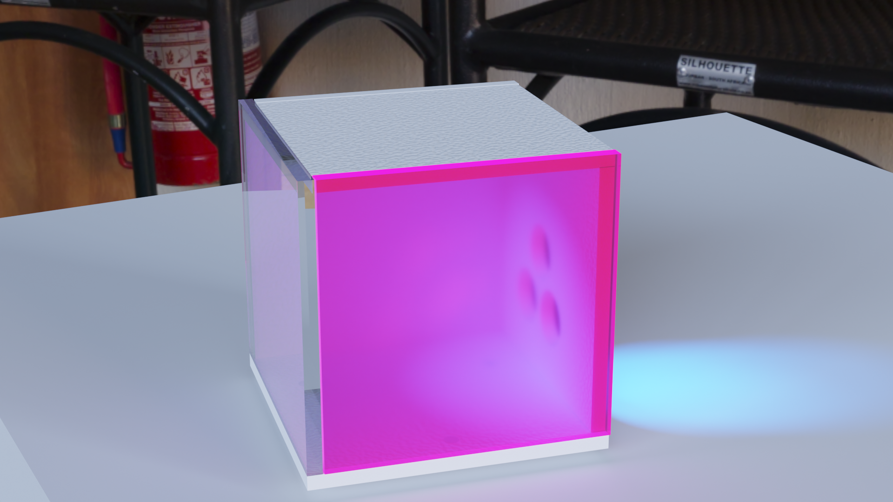

# Rendering in blender

First, check that your application settings are taking advantage of the hardware. These are the settings on my computer. Yours will be different.

Move the camera in your scene to angle you want to render. The *camera view* button allows you to see through the camera.

*Blenderkit* can be accessed in two locations. We can search for materials to apply to objects and HDR (high dynamic range) images to create environments. 

 

Select each object in your environment and apply a material to the surface.

Select an HDR image to use for the environment.

You can now render the image from the *Render* menu. Many more effects are possible by creating lights in your environment.

\nTry adding some lights.
