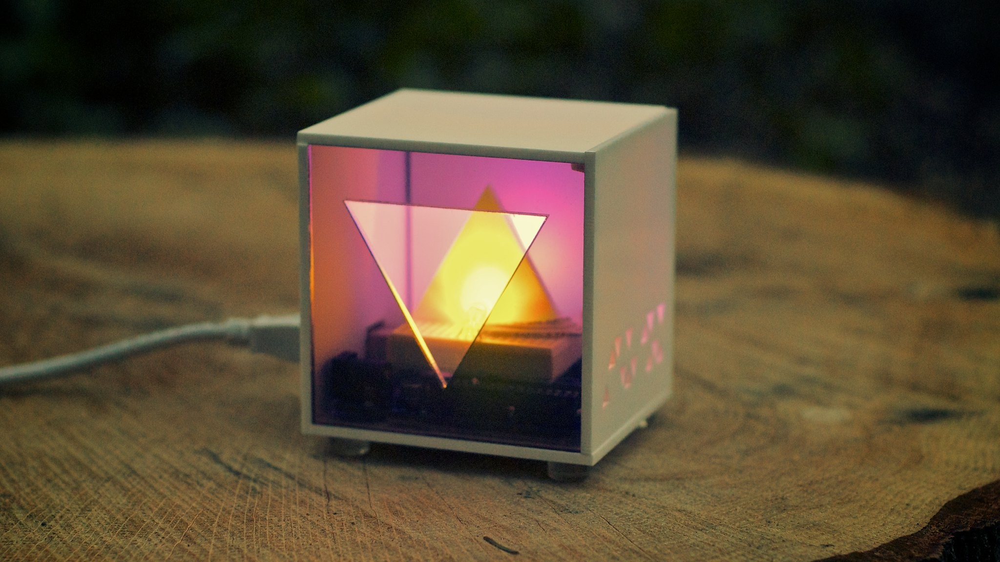
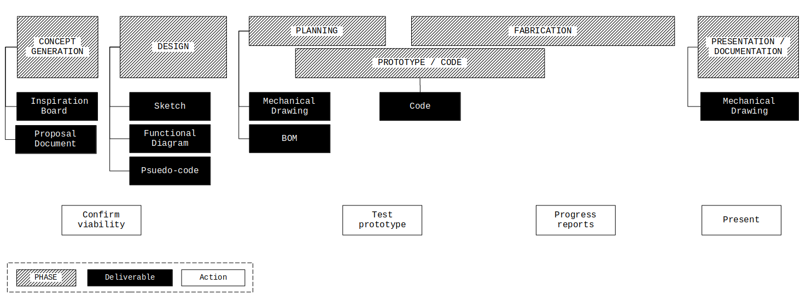
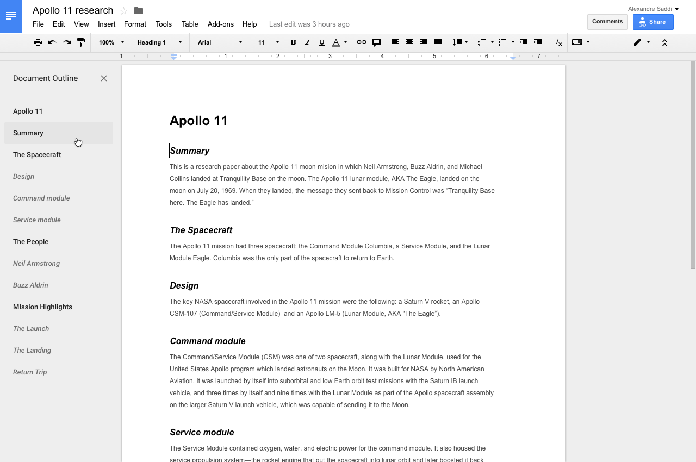
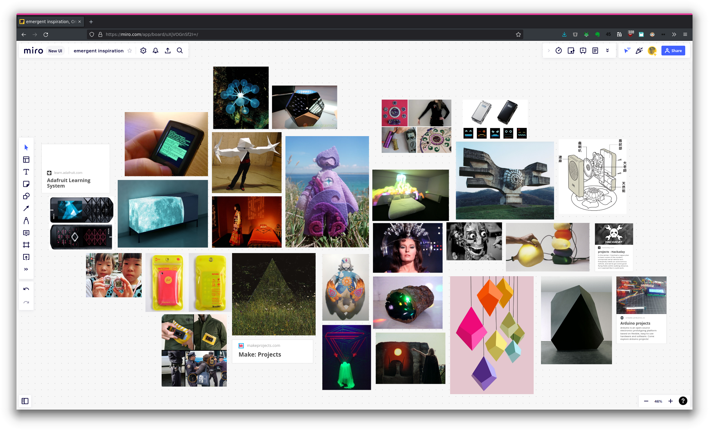
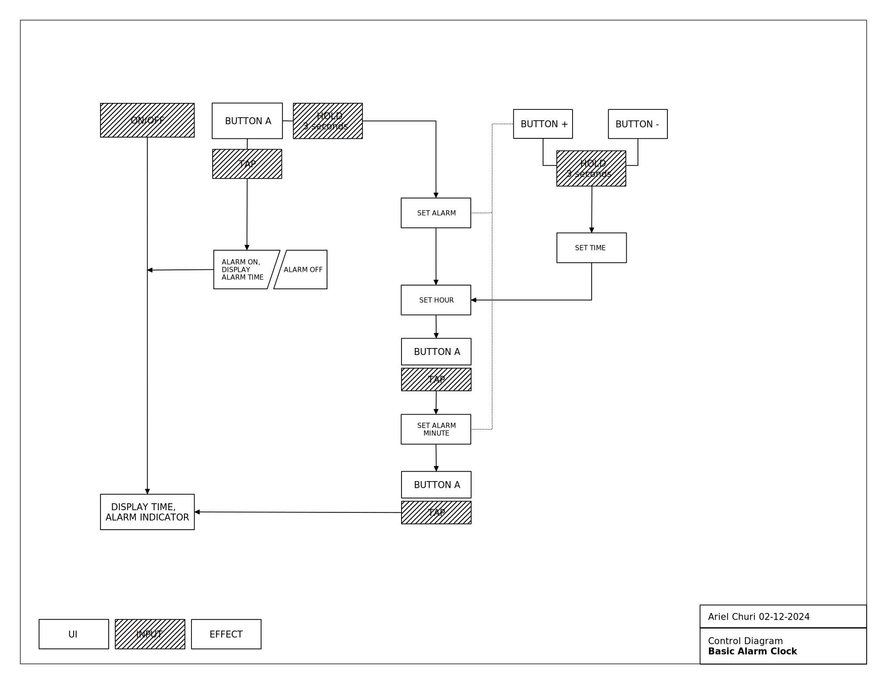
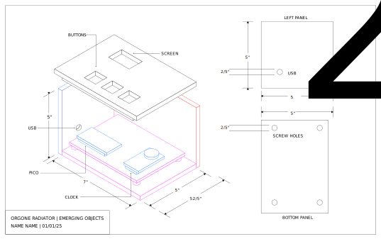
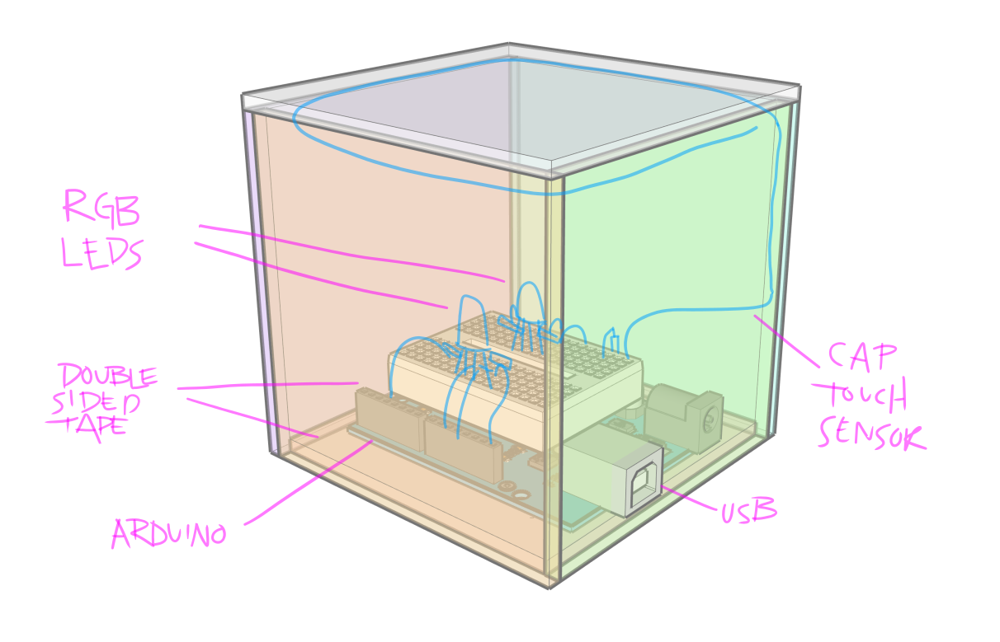
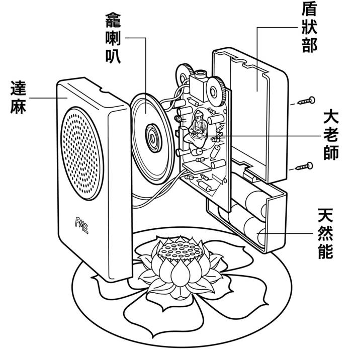
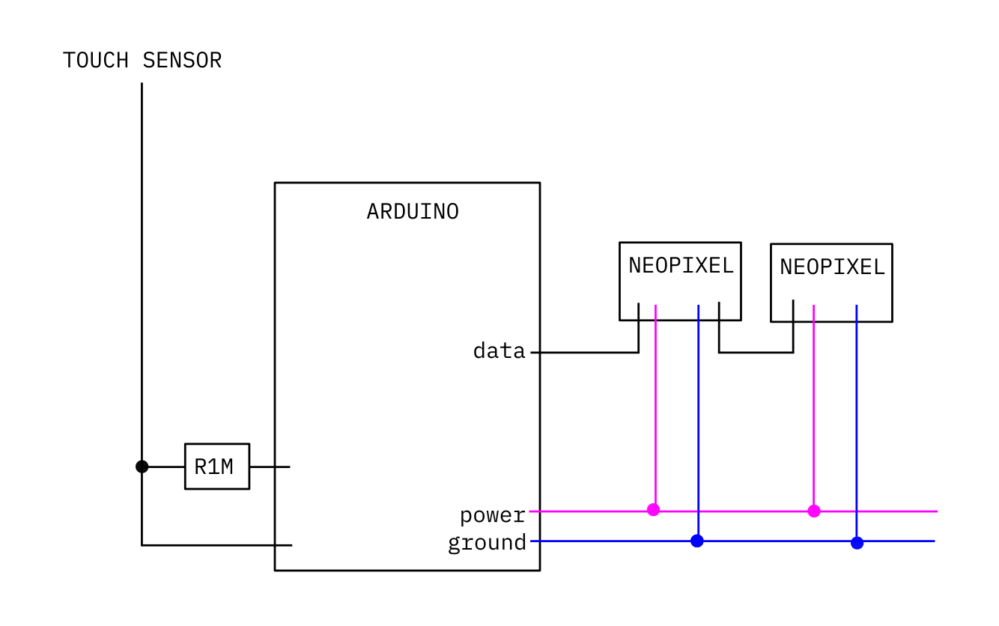

# Emergent Object



## Project Overview

You will design and fabricate an electronic object with a programmed user interface. A complete submission encompasses the following aspects:

- The realization of the design as envisioned
- The success of the user interface and functionality of the object.
- The aesthetic presentation of the object.
- The documentation of the creative process and the final product.

This document describes the process and the first two deliverables required for the _Emergent Objects_ project. Further deliverable descriptions will be appended here.

[Link to github repository](https://github.com/arielchuri/emergentobjects/tree/main/finalproject)

### To do list

- [ ] Inspiration Board (miro, include link in _Proposal Document_)
- [ ] Proposal Document (short _LP_ describing what you will make)
- [ ] Sketch
- [ ] Functional Diagram (graphic)
- [ ] Pseudo-code (py, txt, md)
- [ ] Circuit Diagram (png, jpg, svg)
- [ ] Mechanical Drawing (png, jpg, svg)
- [ ] Bill of Materials (doc, csv, txt, md)
- [ ] Code (py)
- [ ] Documentation post (_Learning Portfolio_)

### Process Diagram



This diagram shows the relationship of the deliverables to the overall phases of the project. Please note that most of the deliverables take place in the beginning of the project.

<!-- [Direct link to diagram](https://arielchuri.github.io/emergentobjects/finalproject/images/process.png) -->

## Proposal Document

<!--  -->

**A*Learning Portfolio* post which includes:**

- A working title for the object.
- A description of the object.
- A description of how the user will interact with the object.
- Any concerns you have about the creation of this object.
- Any links you have to similar works.

## Inspiration Board



Create a board using [Miro](https://miro.com) and layout a collection of images and links. Use this board as a place to both, help design the look and feel of the object you want to create, and collate inspirational or similar projects that you find in your research. You will post a link to your board to Canvas but please share a link with me at [churia@newschool](mailto:churia@newschool.edu) as soon as you have a few items inserted.

Include at least 20 images and links to at least 5 specific projects.

[Pictured Miro board](https://miro.com/app/board/uXjVOGnSf2I=/?invite_link_id=927030846115)

## Functional Diagram

Block diagram describing the process of using the interface.



This diagram was created in [_Libreoffice Draw_](https://www.libreoffice.org). [functional-diagram.odg](./functional-diagram/functional-diagram.odg)

## Pseudo Code

```
Read time from RTC and write it to the display.
Check if button A is pressed
  Show alarm time
  Check if button released < 3 seconds (tap)
    Toggle alarm on/off
  Else > 3 seconds (hold)
    Flash alarm hour
      buttons +/-
        change hour
    button A
    Flash alarm minute
      buttons +/-
        change minute
    button A
      Show time
  Check if button +/- BOTH released > 3 seconds
    Flash time hour
      buttons +/-
        change hour
    button A
    Flash time minute
      buttons +/-
        change minute
    button A
      back to top of code
```

## Mechanical Drawing

A document showing the construction and measurements of the object.



This document was created in [\_Inkscape](https://inkscape.org). [mechanical-m.svg](./images/mechanical-m.svg), [isometcric-drawing.svg](./mechanical_drawing/isometric_drawing.svg)





## Circuit Diagram



## Bill of Materials

| Name              | Type              | Qty. | Link                                            | Measurements                                                                               |
| ----------------- | ----------------- | ---- | ----------------------------------------------- | ------------------------------------------------------------------------------------------ |
| Acrylic           | Matte White       |      |                                                 | 2"x2"x2" and/or link to data                                                               |
|                   | Smoked            |      |                                                 |                                                                                            |
|                   | Clear, green edge |      |                                                 |                                                                                            |
| Arduino UNO       |                   |      |                                                 |                                                                                            |
| Mini breadboard   |                   |      |                                                 |                                                                                            |
| Resistor          | 1M                | 1    |                                                 |                                                                                            |
| Neopixel          | 8mm               | 2    | [source](https://www.adafruit.com/product/1734) | [data](https://www.adafruit.com/images/product-files/1138/SK6812%20LED%20datasheet%20.pdf) |
| Jumper wires      |                   |      |                                                 |                                                                                            |
| Double-sided tape |                   |      |                                                 |                                                                                            |

```
| Name              | Type              | Qty. | Link | Measurements                 |
| ----------------- | ----------------- | ---- | ---- | ---------------------------- |
| Acrylic           | Matte White       |      |      | 2"x2"x2" and/or link to data |
|                   | Smoked            |      |      |                              |
|                   | Clear, green edge |      |      |                              |
| Arduino UNO       |                   |      |      |                              |
| Mini breadboard   |                   |      |      |                              |
| Resistor          | 1M                | 1    |      |                              |
| Neopixel          | 8mm               | 2    |      |                              |
| Jumper wires      |                   |      |      |                              |
| Double-sided tape |                   |      |      |                              |
```
