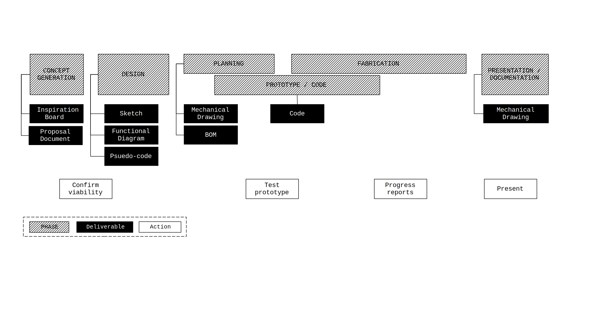

# Emergent Object
<section markdown="1" id="contents">
[TOC]
</section>
<section markdown="1">

## Project Overview

You will design and fabricate an electronic object with a programmed user interface.
A complete submission encompasses the following aspects:

- The realization of the design as envisioned
- The success of the user interface and functionality of the object.
- The aesthetic presentation of the object.
- The documentation of the creative process.

This document describes the deliverables required for the documentation of the *Emergent Objects* project.

### To do list
- &#9634 Inspiration Board
- &#9634 Proposal Document
- &#9634 Sketch
- &#9634 Functional Diagram
- &#9634 Psuedo-code
- &#9634 Mechanical Drawing
- &#9634 Bill of Materials
- &#9634 Code
- &#9634 Documentation post (*Learning Portfolio*)

</section>
<section markdown="1">
## Process Diagram

</section>
<section markdown="1">

## Inspiration Board

Create a board using [Miro](https://miro.com) and layout a collection of images and links.
Use this board as a place to both, help design the look and feel of the object you want to create, and collate inspirational or similar projects that you find in your research.

Include at least 20 images and links to at least 5 specific projects

</section>
<section markdown="1">
{: .border}
## Proposal Document

Create a single page document describing what you will make. Include a description of the object

</section>
<!-- <section markdown="1"> -->
<!--  -->
<!-- ## Functional Diagram -->

<!-- </section> -->
<!-- <section markdown="1"> -->
<!--  -->
<!-- ## Mechanical Drawing -->

<!-- </section> -->
<!-- <section markdown="1"> -->
<!--  -->
<!-- ## Bill of Materials -->

<!-- </section> -->
<!-- <section markdown="1"> -->
<!--  -->
<!-- ## Psuedo-code -->

<!-- </section> -->
<!-- <section markdown="1"> -->
<!--  -->
<!-- ## Code -->

<!-- </section> -->
<!-- <section markdown="1"> -->
<!--  -->
<!-- ## Product One-Sheet -->

<!-- </section> -->
<!-- <section markdown="1"> -->
<!--  -->
<!-- ## Documentation Post -->

</body>
</html>
