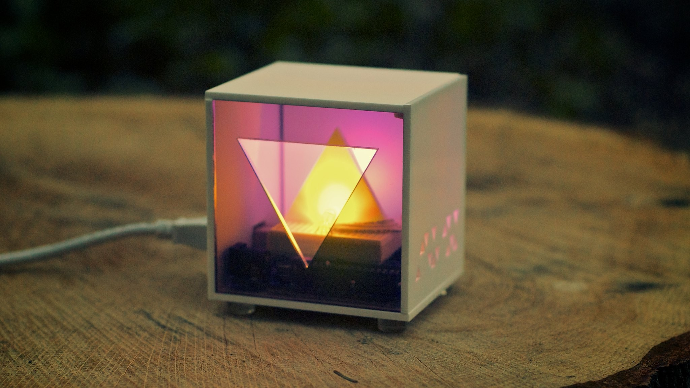
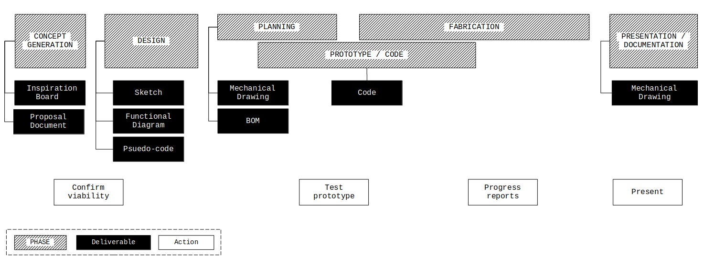

# Emergent Object

## Project Overview

You will design and fabricate an electronic object with a programmed user interface.
A complete submission encompasses the following aspects:

- The realization of the design as envisioned
- The success of the user interface and functionality of the object.
- The aesthetic presentation of the object.
- The documentation of the creative process and the final product.

This document describes the process and the first two deliverables required for the *Emergent Objects* project. Further deliverable descriptions will be appended here.

[Link to github repository](https://github.com/arielchuri/emergentobjects/tree/main/finalproject)

### To do list

- [ ] Inspiration Board (miro, include link in *Proposal Document*)
- [ ] Proposal Document (google doc, txt, md)
- [ ] Sketch
- [ ] Functional Diagram (graphic)
- [ ] Pseudo-code (py, txt, md)
- [ ] Circuit Diagram (png, jpg, svg)
- [ ] Mechanical Drawing (png, jpg, svg)
- [ ] Bill of Materials (doc, csv, txt, md)
- [ ] Code (py)
- [ ] Documentation post (*Learning Portfolio*)

## Proposal Document

Create a single page document describing what you will make.
We will use this document to customize a plan specific to your design goals.
You will post you document to Canvas but please share it me with me at [churia@newschool](mailto:churia@newschool.edu) as soon as possible.

Include:

- A working title for the object.
- A description of the object.
- A description of how the user will interact with the object.
- Any concerns you have about the creation of this object.
- Any links you have to similar works.

## Inspiration Board

Create a board using [Miro](https://miro.com) and layout a collection of images and links.
Use this board as a place to both, help design the look and feel of the object you want to create, and collate inspirational or similar projects that you find in your research.
You will post a link to your board to Canvas but please share a link with me at [churia@newschool](mailto:churia@newschool.edu) as soon as you have a few items inserted.

Include at least 20 images and links to at least 5 specific projects.

[Pictured Miro board](https://miro.com/app/board/uXjVOGnSf2I=/?invite_link_id=927030846115)

## Process Diagram

This diagram shows the relationship of the deliverables to the overall phases of the project. Please note that most of the deliverables take place in the beginning of the project.

[Direct link to diagram](https://arielchuri.github.io/emergentobjects/finalproject/images/process.png)

## Mechanical Drawing

 

## Circuit Diagram

## Bill of Materials

| Name              | Type              | Qty. | Link                                            | Measurements                                                 |
| ----------------- | ----------------- | ---- | ----------------------------------------------- | ------------------------------------------------------------ |
| Acrylic           | Matte White       |      |                                                 | 2"x2"x2" and/or link to data                                 |
|                   | Smoked            |      |                                                 |                                                              |
|                   | Clear, green edge |      |                                                 |                                                              |
| Arduino UNO       |                   |      |                                                 |                                                              |
| Mini breadboard   |                   |      |                                                 |                                                              |
| Resistor          | 1M                | 1    |                                                 |                                                              |
| Neopixel          | 8mm               | 2    | [source](https://www.adafruit.com/product/1734) | [data](https://www.adafruit.com/images/product-files/1138/SK6812%20LED%20datasheet%20.pdf) |
| Jumper wires      |                   |      |                                                 |                                                              |
| Double-sided tape |                   |      |                                                 |                                                              |
