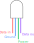
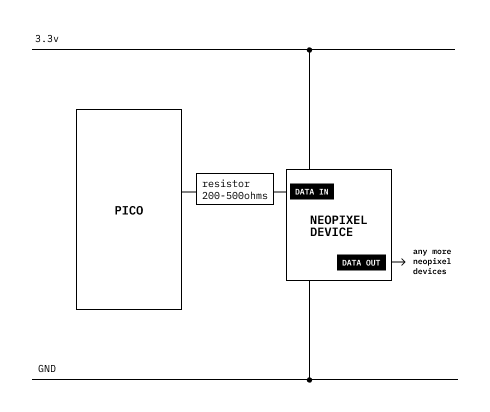
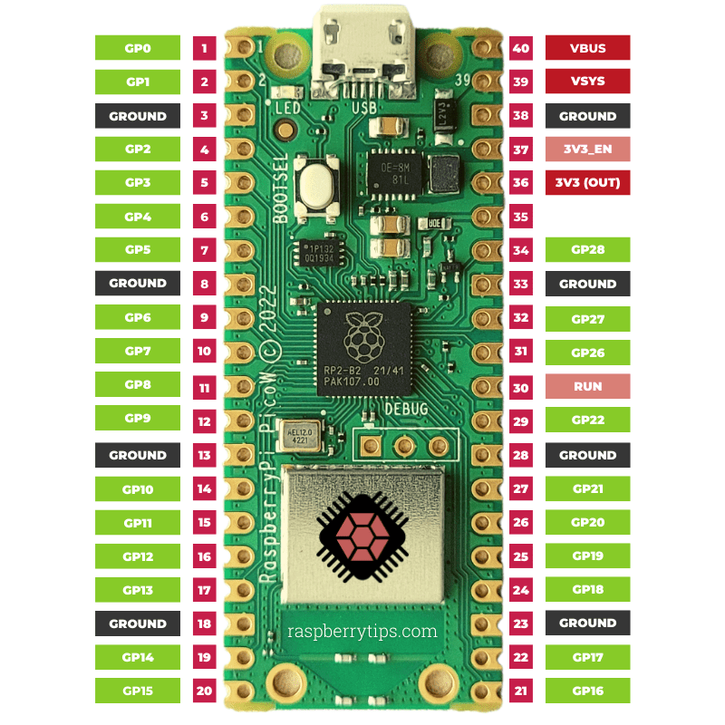

# circuitPython Libraries

Libraries are pre-made chunks of code that you can use to make your code easier.

Many of the devices you may want to use with your micro have libraries to control them.

For this exercise we will use a [neopixel](../parts/neopixel/neopixel.md) and its library.

## Library installation

_microcontroller file structure_

```
  CIRCUITPY
├──  boot_out.txt
├──  code.py
├──  lib          <--- Library folder --<<<
├──  sd
│   └──  placeholder.txt
└──  settings.toml
```

We need to download and find a library for neopixels and place it in our _lib_ folder. Download the Adafruit circuitPython bundle for your version of python (v10 when this was written) from the [circuitPython Libraries](https://circuitpython.org/libraries) page.

On that page you can a bundle of examples of the libraries in use and a _community bundle_ of additional libraries. Inside the _lib_ folder you will find the _neopixel.mpy_ file.

Copy the file into the _lib_ folder of your micro.

## Wiring

Neopixels have 4 pins. Connect your neoPixel to ground, power, and the _data in_ pin to whichever [microcontroller pin](../raspberryPiPico/raspberry_pi_Pico-R3-Pinout-narrow.png) you are using.





_the resistor is not needed for low power circuits_

## Code

```python
import board
import neopixel
import time

print("Hello World!")

pixels = neopixel.NeoPixel(board.GP16, 1) # pin, number of neopixels


while True:
    pixels[0] = (100, 4, 45)                # GRB 0-254
    time.sleep(.05)
    pixels[0] = (15, 60, 44)                # GRB 0-254
    time.sleep(.5)

# If we had three neoPixels we could send them different colors like this
# pixels[0] = (215, 108, 45)
# pixels[1] = (15, 208, 35)
# pixels[2] = (15, 108, 245)

# We can send one color to all of the pixels
# pixels.fill((12, 78, 200))
```

Try this one:

```python
while True:
    for i in range(0, 254, 1):
        pixels[0] = (30, i, 15)
        print("1")
        time.sleep(.001)
    print("3")
    for i in range(254, 0, -1):
        pixels[0] = (30, i, 15)
        print("2")
        time.sleep(.001)
```

## Links

- [NeoPixel in _circuitPython Essentials_](https://learn.adafruit.com/circuitpython-essentials/circuitpython-neopixel)
- [NeoPixel Library Documentation](https://docs.circuitpython.org/projects/neopixel/en/latest/)
- [git repo](https://github.com/adafruit/Adafruit_CircuitPython_NeoPixel)


