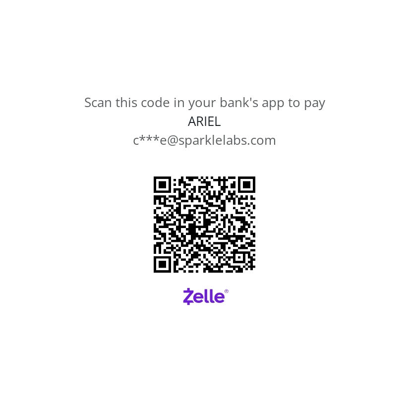

# Materials List

## 2025 Bundle

I can bring in the parts we will work with.

- Solderless Breadboard
- Jumper wires
- Multimeter
- Potentiometer
- Light dependent resistor
- LED
- Resistors: 100-220 (4), 1k (2), 1m
- Button
- Raspberry PI pico w/ headers
- USB Cable (A to mini-B)
- Speaker
- Neopixel (2)
- Touch sensor (2)
- OLED screen
- Ultrasonic range finder
- Real Time Clock

**Cost: $43.50**

You must Venmo, Zelle, or pay in cash before 3/5/25 to get the bundle on time.

### Solderless Breadboard

- [https://a.co/d/hZGCqmh](https://a.co/d/hZGCqmh)

### Jumper wires

- [https://a.co/d/18ncG9M](https://a.co/d/18ncG9M)
- [https://a.co/d/7EPjmAg](https://a.co/d/7EPjmAg)
- [https://a.co/d/4fZfeLf](https://a.co/d/4fZfeLf)
- [https://a.co/d/3MYeyWv](https://a.co/d/3MYeyWv)

### Multimeter

- [https://a.co/d/bxwSE9x](https://a.co/d/bxwSE9x)
- [https://a.co/d/3qjzF2M](https://a.co/d/3qjzF2M)

### Potentiometer

- [https://www.adafruit.com/product/356](https://www.adafruit.com/product/356)

### Light dependent resistor

- [https://www.adafruit.com/product/161](https://www.adafruit.com/product/161)

### LED

- [https://www.adafruit.com/product/4203](https://www.adafruit.com/product/4203)
- [https://a.co/d/e3NDn6c](https://a.co/d/e3NDn6c)

### Resistors: 100-220 (4), 1k (2), 1m

- [https://a.co/d/14alV8X](https://a.co/d/14alV8X)

### Button

- [https://www.adafruit.com/product/1010](https://www.adafruit.com/product/1010)
- [https://a.co/d/2CEHKLa](https://a.co/d/2CEHKLa)
- [https://a.co/d/f4SzBWt](https://a.co/d/f4SzBWt)

### Raspberry PI pico w/ headers

Requires mini-B USB cable that can connect to your computer.

- [https://www.adafruit.com/product/5544](https://www.adafruit.com/product/5544)
- [https://a.co/d/enF8yjf](https://a.co/d/enF8yjf)

### USB Cable (micro-B on one end. The other end must connect to your computer.)

- [https://www.adafruit.com/product/3879](https://www.adafruit.com/product/3879)
- [https://www.adafruit.com/product/4111](https://www.adafruit.com/product/4111)
- [https://a.co/d/hXiPAOO](https://a.co/d/hXiPAOO)

### Speaker (8ohm w/ jumper wires)

- [https://www.adafruit.com/product/1890](https://www.adafruit.com/product/1890)
- [https://a.co/d/b4b3ZEH](https://a.co/d/b4b3ZEH)

### Neopixel (2)

- [https://www.adafruit.com/product/1938](https://www.adafruit.com/product/1938)
- [https://a.co/d/9X77yoo](https://a.co/d/9X77yoo)

### Touch sensor (2)

- [https://a.co/d/e60zMlk](https://a.co/d/e60zMlk)

### OLED screen

- [https://a.co/d/1frvgOG](https://a.co/d/1frvgOG)

### Ultrasonic range finder

- [https://a.co/d/20eNPff](https://a.co/d/20eNPff)

### Real Time Clock

- [https://a.co/d/f2vtjc5](https://a.co/d/f2vtjc5)

### Multimeter

All of these are low quality but will work fine for our purposes.

- I have a low end model and can bring it to class. $9.00
- [One of many on amazon](https://smile.amazon.com/AstroAI-Digital-Multimeter-Voltage-Tester/dp/B01ISAMUA6/) $12.50
- [Adafruit Multimeter](https://www.adafruit.com/product/2034) $17.50

### Microcontroller

- [Raspberry Pi Pico](https://www.adafruit.com/product/5544)

### Examples of premade kits

(These only have the electronic components)

- [Discover Electronics Kit](http://sparklelabs.com/index_store.php) $46.75 - I make these.
- [Make Electronics Kit](https://www.amazon.com/Make-Electronics-Intermediate-Component-Experiments/dp/B09HL84X33/) $117.99 - Includes a Multitester and soldering iron.

These two are the most barebones I could find on amazon. The quality maybe low but they should be good enough.

- [amazon Kit 1](https://smile.amazon.com/REXQualis-Electronics-tie-Points-Breadboard-Potentiometer/dp/B073ZC68QG/) $18.49
- [Amazon Kit 2](https://smile.amazon.com/EL-CK-002-Electronic-Breadboard-Capacitor-Potentiometer/dp/B01ERP6WL4/) $13.99

## Additional materials

This is a list of some materials you may need depending on the object you want to make.

- Wire strippres
- Wire cutters
- Soldering iron
- Solder
- Solder sucker
- Helping hands
- Conductive thread
- Lithium Ion battery pack
- Sewable battery holder
- Casting and molding compounds
- Modeling clay

[Making Center Tool List](https://drive.google.com/file/d/1dF-RaKN6y5C2Pp43RNqfa-ncEDPiNYUA/view?usp=sharing)
