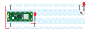
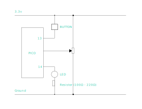
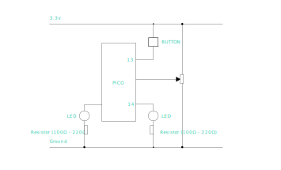

# Microcontroller Intro

## Overview

We will connect our microcontroller to any inputs, such as buttons and sensors, and outputs, such a lights, motors, and speakers. We will program our microcontroller to use the devices.

We program our microcontroller by editing a text file on the microcontroller. This requires a data-capable, USB cable to connect our computer to the microcontroller and an application to edit the text file and upload it. The first step is to follow the directions for your microcontroller. I have included the appropriate tutorials below.

This guide contains everything you need to set up your microcontroller: [Getting Started with Raspberry Pi Pico and CircuitPython](https://learn.adafruit.com/getting-started-with-raspberry-pi-pico-circuitpython)

1. Download the UF2 file [from this page](https://circuitpython.org/board/raspberry_pi_pico/).
2. Follow the directions [on this page](https://learn.adafruit.com/getting-started-with-raspberry-pi-pico-circuitpython/circuitpython) to load the file on your chip.

Following those steps will cause the Raspberry PI Pico to appear as thumbdrive on your desktop. If you have or create a text file named _code.py_, it will run automatically. You can use the MU editor or Visual Studio Code with the circuitPython extension to edit your _code.py_ file.

- [Circuit Playground Quickstart](https://learn.adafruit.com/circuit-playground-express-circuitpython-5-minute-guide)

- [Mu Editor](https://learn.adafruit.com/welcome-to-circuitpython/installing-mu-editor)

### Other microcontrollers

- [Adafruit Circuit Playground Express](https://learn.adafruit.com/adafruit-circuit-playground-express)

- [Arduino UNO](https://docs.arduino.cc/hardware/uno-rev3)

## Raspberry Pi Pico Pinout Diagram


## Connecting to a circuit

The next step is to connect your MC to circuit.

### Circuit illustration



### Circuit schematic


### Code

This code is for the above circuit.

```python
# Setup the pins for the pot, leds and buttons.
led1 = digitalio.DigitalInOut(board.GP14)
led1.direction = digitalio.Direction.OUTPUT

while True:
    # This line prints the pot value to the terminal.
    led1.value = 1
    time.sleep(0.15)
    led1.value = 0
    time.sleep(0.35)
```

### Exercises

1. Blink the led S.O.S
2. Blink an led using a _loop_.

## Button

### Code

```python
# Setup the pins for the pot, leds and buttons.
led1 = digitalio.DigitalInOut(board.GP14)
led1.direction = digitalio.Direction.OUTPUT

button1 = digitalio.DigitalInOut(board.GP13)
button1.switch_to_input(pull=digitalio.Pull.DOWN)

while True:
    led1.value = button1.value
```

### Circuit illustration


### Circuit


## Moving on

Create the following circuits to use these basic features of your micro.

Try to follow the tutorials for your micro to do the following individually:

- Blink an LED (digital output)
- Sense a button (digital input)
- Sense a potentiometer (analog input)
- Fade on LED (analog output using PWM)

circuit illo FPO

Here are some tutorials:

[Raspberry Pico Led/Button](https://learn.adafruit.com/getting-started-with-raspberry-pi-pico-circuitpython/blinky-and-a-button)

[Raspberry Pico PWM and Pot](https://learn.adafruit.com/getting-started-with-raspberry-pi-pico-circuitpython/potentiometer-and-pwm-led)

[CircuitPlayground Button and LED](https://learn.adafruit.com/adafruit-circuit-playground-express/circuitpython-digital-in-out)

[CircuitPlayground Pot](https://learn.adafruit.com/adafruit-circuit-playground-express/circuitpython-analog-in)

[CircuitPlayground PWM](https://learn.adafruit.com/adafruit-circuit-playground-express/circuitpython-pwm)

[Arduino - Blink](https://docs.arduino.cc/built-in-examples/basics/Blink)

[Arduino - Button](https://docs.arduino.cc/built-in-examples/digital/Button)

[Arduino Pot](https://docs.arduino.cc/built-in-examples/basics/ReadAnalogVoltage)

[Arduino - PWM](https://docs.arduino.cc/built-in-examples/basics/Fade)

The following code has all of the inputs and outputs.

```python
# Setup the pins for the pot, leds and buttons.
led1 = digitalio.DigitalInOut(board.GP14)
led1.direction = digitalio.Direction.OUTPUT
led2 = pwmio.PWMOut(board.GP15, frequency=1000)

button1 = digitalio.DigitalInOut(board.GP13)
button1.switch_to_input(pull=digitalio.Pull.DOWN)

potentiometer = analogio.AnalogIn(board.GP26)

while True:
    # This line prints the pot value to the terminal.
    print(potentiometer.value)
    time.sleep(0.05)
    led1.value = button1.value
    # This line sets the PWM (pulse width modulation) to the potentiometer value.
    led2.duty_cycle = potentiometer.value
```

There are two problems. We cannot use the sleep function to blink the LED because the micro will sleeping instead of checking the button and pot. The second problem is that a button can have a little bounce which the micro sees as many button presses and we want the button change the way our device works even after the user finishes pressing it.

There are code libraries that can take care of these issues but we can do it ourselves for code as simple as this.

## Advanced Button

First lets fix the button. We will create a variable called _myMode1_ for the button and then we can use the variable to control whatever we want.

```python
import board
import digitalio
import analogio
import pwmio
import time


# Setup the pins for the pot, leds and buttons.
led1 = digitalio.DigitalInOut(board.GP14)
led1.direction = digitalio.Direction.OUTPUT
led2 = pwmio.PWMOut(board.GP15, frequency=1000)

button1 = digitalio.DigitalInOut(board.GP13)
button1.switch_to_input(pull=digitalio.Pull.DOWN)

potentiometer = analogio.AnalogIn(board.GP26)

# Create the variables

previousButton1State = button1.value

# This is the variable that will change when we press the button.
myMode1 = False

while True:
    currentButton1State = button1.value
    if currentButton1State != previousButton1State:
        # print statements like these can be seen in the serial terminal
        # print('yes')
        if not currentButton1State:
            myMode1 = not myMode1
            print('myMode1 =', myMode1)
            print("up")
        else:
            print("down")
    previousButton1State = currentButton1State
    led1.value = myMode1
    # print("led1 = ", led1.value)
    # This line sets the PWM (pulse width modulation) to the potentiometer value.
    led2.duty_cycle = potentiometer.value
```

Now the LED stays on or off when we press the button.

## Blinking the LED without sleep

To get rid of the sleep command, the micro needs to keep track of how long the led has been on or off and change it after a set amount of time has passed.

The following code does this.

```python
import time
import digitalio
import board

# How long we want the LED to stay on
BLINK_ON_DURATION = 0.5

# How long we want the LED to stay off
BLINK_OFF_DURATION = 0.25

# When we last changed the LED state
LAST_BLINK_TIME = -1

# Setup the LED pin.
led = digitalio.DigitalInOut(board.GP14)
led.direction = digitalio.Direction.OUTPUT

while True:
    # Store the current time to refer to later.
    now = time.monotonic()
    if not led.value:
        # Is it time to turn on?
        if now >= LAST_BLINK_TIME + BLINK_OFF_DURATION:
            led.value = True
            LAST_BLINK_TIME = now
    if led.value:
        # Is it time to turn off?
        if now >= LAST_BLINK_TIME + BLINK_ON_DURATION:
            led.value = False
            LAST_BLINK_TIME = now
```

Now, lets put the new blink code with the previous button code:

```python
import board
import digitalio
import analogio
import pwmio
import time


# Setup the pins for the pot, leds and buttons.
led1 = digitalio.DigitalInOut(board.GP14)
led1.direction = digitalio.Direction.OUTPUT
led2 = pwmio.PWMOut(board.GP15, frequency=1000)

button1 = digitalio.DigitalInOut(board.GP13)
button1.switch_to_input(pull=digitalio.Pull.DOWN)

potentiometer = analogio.AnalogIn(board.GP26)

# Create the variables

previousButton1State = button1.value

# This is the variable that will change when we press the button.
myMode1 = False

# How long we want the LED to stay on
BLINK_ON_DURATION = 0.01

# How long we want the LED to stay off
BLINK_OFF_DURATION = 0.5

# When we last changed the LED state
LAST_BLINK_TIME = -1

while True:
    if myMode1 == True:
        # Store the current time to refer to later.
        now = time.monotonic()
        if not led1.value:
            # Is it time to turn on?
            if now >= LAST_BLINK_TIME + BLINK_OFF_DURATION:
                led1.value = True
                LAST_BLINK_TIME = now
        if led1.value:
            # Is it time to turn off?
            if now >= LAST_BLINK_TIME + BLINK_ON_DURATION:
                led1.value = False
                LAST_BLINK_TIME = now
    else:
        led1.value = False

    currentButton1State = button1.value
    if currentButton1State != previousButton1State:
        # print statements like these can be seen in the serial terminal
        # print('yes')
        if not currentButton1State:
            myMode1 = not myMode1
            print('myMode1 =', myMode1)
            print("up")
        else:
            print("down")
    previousButton1State = currentButton1State
    # print("led1 = ", led1.value)
    # This line sets the PWM (pulse width modulation) to the potentiometer value.
    led2.duty_cycle = potentiometer.value
```

## Analog In

### Potentiometer



```python
import board
import digitalio
import analogio
import time


# Setup the pins for the pot, leds and buttons.
led1 = digitalio.DigitalInOut(board.GP14)
led1.direction = digitalio.Direction.OUTPUT

button1 = digitalio.DigitalInOut(board.GP13)
button1.switch_to_input(pull=digitalio.Pull.DOWN)

potentiometer = analogio.AnalogIn(board.GP26)

while True:
    print(potentiometer.value)
```

### Light Dependant Resistor


## PWM Out

```python
# Emergent Objects
import board
import digitalio
import analogio
import pwmio
import time


# Setup the pins for the pot, leds and buttons.
led1 = digitalio.DigitalInOut(board.GP14)
led1.direction = digitalio.Direction.OUTPUT
led2 = pwmio.PWMOut(board.GP15, frequency=1000)

button1 = digitalio.DigitalInOut(board.GP13)
button1.switch_to_input(pull=digitalio.Pull.DOWN)

potentiometer = analogio.AnalogIn(board.GP26)

while True:
    led2.dutycycle = 5000
```

## PWM Out

```python
# Emergent Objects
import board
import digitalio
import analogio
import pwmio
import time


# Setup the pins for the pot, leds and buttons.
led1 = digitalio.DigitalInOut(board.GP14)
led1.direction = digitalio.Direction.OUTPUT
led2 = pwmio.PWMOut(board.GP15, frequency=1000)

button1 = digitalio.DigitalInOut(board.GP13)
button1.switch_to_input(pull=digitalio.Pull.DOWN)

potentiometer = analogio.AnalogIn(board.GP26)
ldr = analogio.AnalogIn(board.GP27)

while True:
    # print the sensors
    print(f"button = {button1.value}\t| potentiometer = {potentiometer.value}\t| LDR = {ldr.value}")
```



---


```python
import board
import digitalio
import analogio
import pwmio
import time


# Setup the pins for the pot, leds and buttons.
led1 = digitalio.DigitalInOut(board.GP14)
led1.direction = digitalio.Direction.OUTPUT
led2 = pwmio.PWMOut(board.GP15, frequency=1000)

button1 = digitalio.DigitalInOut(board.GP13)
button1.switch_to_input(pull=digitalio.Pull.DOWN)

potentiometer = analogio.AnalogIn(board.GP26)
ldr = analogio.AnalogIn(board.GP27)

# Create the variables

previousButton1State = button1.value

# This is the variable that will change when we press the button.
myMode1 = False

while True:
    currentButton1State = button1.value
    if currentButton1State != previousButton1State:
        # print statements like these can be seen in the serial terminal
        # print('yes')
        if not currentButton1State:
            myMode1 = not myMode1
            print('myMode1 =', myMode1)
            print("ldr.value")
        else:
            print("down")
    previousButton1State = currentButton1State
    led1.value = myMode1
    # print("led1 = ", led1.value)
    # This line sets the PWM (pulse width modulation) to the potentiometer value.
    led2.duty_cycle = potentiometer.value

```
