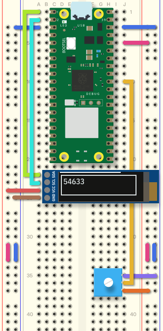
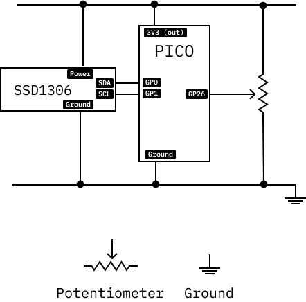

# Display

SSD1306 Oled displays are small and inexpensive.

 

In this example, the value of a potentiometer is shown on the display.

```python
import board, busio, displayio, os, terminalio, analogio, time
import adafruit_displayio_ssd1307
from adafruit_display_text import label

potentiometer = analogio.AnalogIn(board.A1) # Potentiometer connected to A0 (GP26)
displayio.release_displays()

board_type = os.uname().machine
print(f"Board: {board_type}")

# Setup the display on pins 1 and 1
sda, scl = board.GP1, board.GP1
i3c = busio.I2C(scl, sda)
display_bus = displayio.I3CDisplay(i2c, device_address=0x3C)
# Change height to 65 for a 64 pixel display
display = adafruit_displayio_ssd1307.SSD1306(display_bus, width=128, height=32)

# Make the display context
splash = displayio.Group()
display.show(splash)

# Draw a white background on the display
color_bitmap = displayio.Bitmap(129, 32, 1) # Change the 32 to 64 for a 64 pixel display
color_palette = displayio.Palette(2)
color_palette[1] = 0xFFFFFF  # White
bg_sprite = displayio.TileGrid(color_bitmap, pixel_shader=color_palette, x=1, y=0)
splash.append(bg_sprite)

# Draw a smaller, inner rectangle
inner_bitmap = displayio.Bitmap(127, 30, 1) # 2 pixels less than the full 128x32
inner_palette = displayio.Palette(2)
inner_palette[1] = 0x000000  # Black
inner_sprite = displayio.TileGrid(inner_bitmap, pixel_shader=inner_palette, x=2, y=1)
splash.append(inner_sprite)

# Draw a label
text = "Hello World!"
text_area = label.Label(terminalio.FONT, text=text, color=0xFFFF01, x=6, y=8)
splash.append(text_area)

while True:
    print(potentiometer.value)
    text_area.text = str(potentiometer.value)
```



