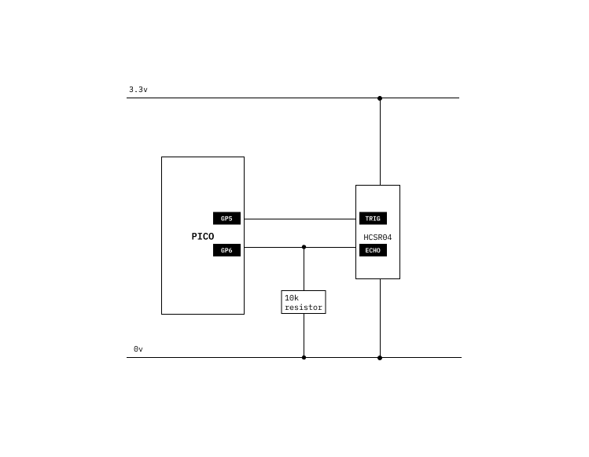

# Ultrasonic sensor

- [product page](https://learn.adafruit.com/ultrasonic-sonar-distance-sensors) There are new versions of this product.

You will need to drag the _adafruit_hcsr04.mpy_ library file into the _lib_ folder on your micro.

- [circuitPython library bundles](https://circuitpython.org/libraries)

- [adafruit learn page](https://learn.adafruit.com/ultrasonic-sonar-distance-sensors)

```python
# SPDX-FileCopyrightText: 2021 ladyada for Adafruit Industries
# SPDX-License-Identifier: MIT

import board
import time
import board
import adafruit_hcsr04  # the library
sonar = adafruit_hcsr04.HCSR04(trigger_pin=board.GP5, echo_pin=board.GP6)

# For the potentiometer.
while True:
    try:
        print(sonar.distance)
        my_distance = sonar.distance
    except RuntimeError:
        print("Retrying!")
    time.sleep(0.01)

    if my_distance > 40:
        print("GET BACK!")
```


