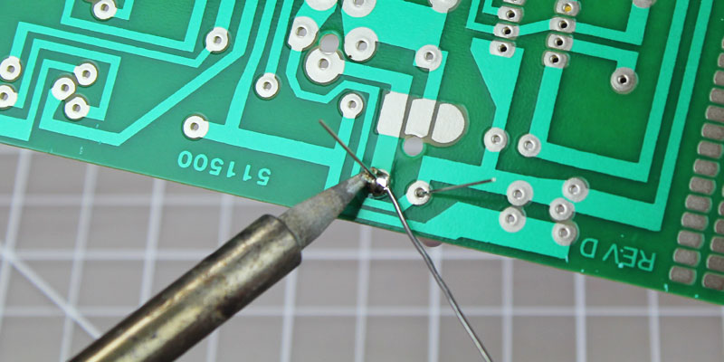

# Soldering
<section markdown="1">

## Soldering
Soldering is a way to ensure a permanent electrical connection between two conductors. The conductors are heated so that, when the melted solder flows over them, there is a strong bond. Incorrect soldering can lead to problems later so it is important to learn to solder correctly.

You will need to have the items you wish to solder secured in some way. You may use a vice, a c-clamp, or *helping hands*. You will need a fine-point soldering iron, solder, and a lightly damp sponge.
#### Befor you begin
1. Ensure the tip of the iron is attached correctly.
1. Allow the soldering iron time to fully heat up.
1. Clean the tip of the iron by touching it to the damp sponge.
1. *Tin* the tip by applying a small amount of solder.
#### To solder
1. Clean the tip of the iron by touching it to the damp sponge.
1. Heat the point of contact of the two conductors.
1. With the iron still in place, touch the point of contact of the two conductors with the solder and allow a small amount of solder to flow over the point of contact.
1. Remove the solder and iron and allow the joint to cool without moving it.

### Removing Solder
Sometimes it nessecary to remove solder you have applied. Either to remove a part or because there is excess solder.

Reheat the solder with your iron and apply *solder wick* or use a *solder sucker*.
</section>
</body>
</html>
